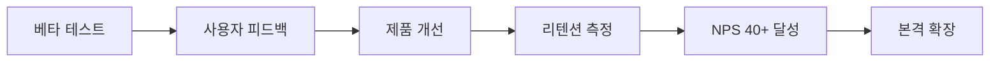
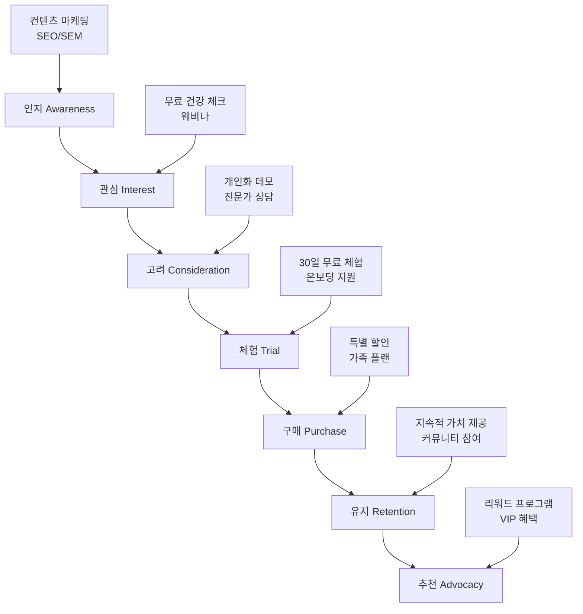

# 센테니얼 라이프 2025 비즈니스 전략
## 100세 시대 웰니스 플랫폼의 전략적 로드맵

---

### 📋 문서 정보
- **작성일**: 2025년 6월
- **버전**: 2025 v1.0
- **대상**: 경영진, 투자자, 사업 개발팀
- **범위**: 전체 비즈니스 전략 및 실행 계획

---

## 🎯 Executive Summary

### 비즈니스 비전
**"1인 창업자가 만드는 AI 웰니스 동반자"**

센테니얼 라이프는 1인 창업자가 부트스트랩 방식으로 시작하여, AI 기술을 활용한 개인 맞춤형 웰니스 솔루션으로 100세 시대의 건강한 삶을 지원하는 혁신적인 플랫폼을 만들어 나갑니다.

### 전략적 목표 (2025-2027)
- **시장 지위**: 1인 개발자 웰니스 앱 중 독창성 1위
- **사용자 규모**: 월간 활성 사용자 15,000명
- **수익 목표**: 월 반복 수익(MRR) $30K 달성
- **서비스 범위**: 한국 시장 중심 안정적 성장

### 핵심 성공 요인
1. **MVP 중심 개발**: 건강추적, 정신건강, 커뮤니티 3개 영역 집중
2. **단순한 AI 활용**: OpenAI API 기반 개인화 추천
3. **부트스트랩 성장**: 외부 투자 없이 수익 기반 성장
4. **1인 운영 최적화**: 자동화와 효율적 도구 활용

---

## 🌟 시장 기회 분석

### 글로벌 시장 환경 (2025)

**개인 웰니스 앱 시장**:
- 시장 규모: 한국 웰니스 앱 시장 약 1,500억원 (2025년 예상)
- 연평균 성장률: 12% (한국 시장)
- 타겟 사용자: 40-70세 건강 관심층 약 800만명

**1인 개발자 시장**:
- 시장 특성: 소규모 전문화된 솔루션 선호
- 성공 사례: 개인 앱 개발자 연 수익 $100K-500K 달성 다수
- 경쟁 우위: 대기업 대비 빠른 의사결정과 개인화

**시니어 테크 시장**:
- 시장 규모: $320억 (2025년 예상)
- 주요 성장 지역: 아시아 태평양 (36%), 북미 (31%)
- 핵심 니즈: 건강 관리, 사회적 연결, 재정 관리

### 타겟 시장 세분화

**Primary Market (핵심 타겟)**:
```
🎯 건강 관심 중장년층 (45-65세)
├── 규모: 한국 500만명
├── 특성: 스마트폰 활용, 건강 관리 니즈 높음
├── 구매력: 월 웰니스 지출 $30-100
└── 지역: 한국 수도권 및 주요 도시
```

**Secondary Market (확장 타겟)**:
```
🎯 헬스 컨셔스 중년층 (40-55세)
├── 규모: 전 세계 3억 5천만 명
├── 특성: 예방 중심 건강 관리 관심
├── 구매력: 연간 웰니스 지출 $1,500-4,000
└── 지역: 전 세계 주요 도시권
```

**Tertiary Market (신규 타겟)**:
```
🎯 기업 웰니스 (B2B)
├── 규모: 전 세계 5만 개 기업
├── 특성: 직원 웰니스 프로그램 관심
├── 구매력: 직원당 연간 $200-800
└── 지역: 선진국 중심 대기업
```

---

## 💼 비즈니스 모델 혁신

### 다층 수익 구조 2.0

**단일 구독 서비스 (100% 수익)**

```
📱 센테니얼 라이프 구독
├── 무료 체험: 7일 모든 기능 체험
├── 월간 구독 ($9.99/월): 모든 기능 이용
├── 연간 구독 ($99/년): 월간 대비 17% 할인
└── 가족 플랜 ($19.99/월): 최대 4명 계정
```

**2. B2B 엔터프라이즈 (30% 예상 수익)**

```
🏢 기업 웰니스 솔루션
├── Corporate Basic ($29/직원/월): 기본 웰니스 프로그램
├── Corporate Premium ($59/직원/월): 고급 분석, 맞춤형 프로그램
├── Enterprise ($99/직원/월): 전사 통합, 전담 컨설팅
└── Healthcare Partnership: 병원/보험사 맞춤 솔루션
```

**3. AI 서비스 및 데이터 (20% 예상 수익)**

```
🤖 AI-Powered Services
├── Health Risk Assessment: 보험사 대상 위험도 평가
├── Clinical Trial Platform: 제약회사 대상 환자 모집
├── Population Health Insights: 공공보건 기관 대상 분석
└── Personalized Medicine: 정밀의학 데이터 제공
```

**4. 마켓플레이스 및 커머스 (10% 예상 수익)**

```
🛒 Wellness Marketplace
├── 맞춤형 건강기능식품 큐레이션
├── 웰니스 제품 및 서비스 중개
├── 전문가 서비스 플랫폼 (영양사, 트레이너 등)
└── 웰니스 여행 및 체험 상품
```

### 수익 다변화 전략

**단계별 수익 모델 진화**:

**Phase 1 (2025)**: MVP 출시 및 검증
- 목표: MRR $5K
- 주력: 핵심 기능 3개 영역 완성
- 사용자: 500명 베타 사용자

**Phase 2 (2026)**: 안정적 성장
- 목표: MRR $15K
- 주력: 사용자 피드백 기반 개선
- 사용자: 5,000명 활성 사용자

**Phase 3 (2027)**: 수익성 달성
- 목표: MRR $30K
- 주력: 수익성 확보 및 지속가능성
- 사용자: 15,000명 활성 사용자

---

## 🚀 시장 진입 전략

### Go-to-Market 전략

**1. 제품-시장 적합성 검증 (PMF)**



**핵심 지표**:
- 월간 유지율: 75% 이상
- NPS 스코어: 40 이상
- 일일 활성 사용자: 70% 이상

**2. 지역별 진출 전략**

**단일 시장 집중 전략 (2025-2027)**
```
🇰🇷 한국 시장 집중
├── 전략: 로컬 특화 건강 관리 솔루션
├── 채널: 블로그, 유튜브, 네이버 카페
├── 마케팅: 콘텐츠 마케팅, SEO 최적화
└── 목표: 15,000명 사용자, MRR $30K
```

**Wave 2: 북미 (2026)**
```
🇺🇸 미국
├── 전략: AI 개인화 기술 차별화
├── 파트너: Apple Health, Google Health
├── 채널: 디지털 퍼포먼스 마케팅
└── 목표: 20만 사용자, $8M ARR

🇨🇦 캐나다
├── 전략: 공공 헬스케어 시스템 연계
├── 파트너: 주정부 보건당국
├── 채널: B2G 영업, 헬스케어 컨퍼런스
└── 목표: 5만 사용자, $2M ARR
```

**Wave 3: 유럽 (2027)**
```
🇬🇧 영국, 🇩🇪 독일, 🇫🇷 프랑스
├── 전략: GDPR 준수 프라이버시 강조
├── 파트너: 현지 보험사, 헬스케어 제공자
├── 채널: B2B 파트너십, 의료진 추천
└── 목표: 15만 사용자, $6M ARR
```

### 채널 전략

**저비용 마케팅 (100% 유기적 성장)**:
- **콘텐츠 마케팅**: 건강 정보 블로그, 유튜브 채널
- **SEO 최적화**: 롱테일 키워드 중심 최적화
- **커뮤니티 활동**: 네이버 카페, 건강 관련 온라인 커뮤니티
- **입소문 마케팅**: 사용자 추천 시스템

**파트너십 (25% 마케팅 예산)**:
- **헬스케어 제공자**: 병원, 클리닉, 약국
- **보험사**: 웰니스 프로그램 통합
- **웨어러블 제조사**: 데이터 연동 및 번들링
- **기업 고객**: HR 부서를 통한 직원 웰니스

**오프라인 (15% 마케팅 예산)**:
- **헬스케어 컨퍼런스**: 전문가 네트워킹
- **시니어 커뮤니티**: 노인복지관, 실버타운
- **의료진 교육**: 세미나 및 워크샵
- **체험 부스**: 건강 박람회, 웰니스 페어

---

## 🤝 전략적 파트너십

### 파트너십 생태계 구축

**Tier 1: 핵심 기술 파트너**
```
🔗 기본 API 연동
├── Apple HealthKit: 기본 건강 데이터 연동
├── Google Fit: 안드로이드 기본 연동
├── 수동 입력: 웨어러블 없는 사용자 지원
└── 사진 업로드: 운동, 음식 사진 기록
```

**Tier 2: 헬스케어 파트너**
```
🏥 의료 서비스 파트너
├── Mayo Clinic: 콘텐츠 및 의료진 자문
├── Kaiser Permanente: 통합 헬스케어 솔루션
├── 서울아산병원: 아시아 의료 허브 연계
└── Teladoc: 원격의료 서비스 통합
```

**Tier 3: 보험 및 금융 파트너**
```
💰 보험 및 금융 파트너
├── Cigna: 웰니스 프로그램 통합
├── MetLife: 생명보험 상품 연계
├── 삼성생명: 한국 시장 보험 상품
└── Prudential: 아시아 시장 확장
```

### 파트너십 가치 제안

**헬스케어 제공자를 위한 가치**:
- **환자 참여도 향상**: 병원 외 지속적인 건강 관리
- **예측적 케어**: AI 기반 조기 위험 감지
- **비용 절감**: 예방 중심 케어를 통한 의료비 절감
- **데이터 인사이트**: 인구 집단 건강 트렌드 분석

**보험사를 위한 가치**:
- **위험 평가**: 실시간 건강 데이터 기반 정확한 리스크 모델링
- **클레임 감소**: 예방적 건강 관리를 통한 보험금 지급 감소
- **고객 유지**: 부가 가치 서비스를 통한 고객 로열티 향상
- **신상품 개발**: 개인화된 보험 상품 설계 지원

---

## 📊 경쟁 전략

### 경쟁 환경 분석

**직접 경쟁사**:
```
🥊 Direct Competitors
├── MyFitnessPal (Under Armour): 영양 및 운동 중심
├── Noom: AI 기반 체중 관리 및 건강 코칭
├── Calm: 정신 건강 및 명상 플랫폼
└── Oura Ring: 웨어러블 기반 건강 추적
```

**간접 경쟁사**:
```
🏃 Indirect Competitors
├── Apple Health: 플랫폼 통합 건강 앱
├── Google Fit: 안드로이드 기반 피트니스 추적
├── Samsung Health: 갤럭시 생태계 건강 서비스
└── Teladoc: 원격의료 서비스
```

### 차별화 전략

**1. 통합적 웰니스 접근법**
- **10개 영역 통합**: 단편적 앱들과 차별화
- **AI 기반 상관관계**: 영역 간 상호작용 분석
- **홀리스틱 건강**: 신체, 정신, 사회적 웰빙 통합

**2. 시니어 특화 디자인**
- **접근성 우선**: 큰 텍스트, 단순한 UI/UX
- **음성 인터페이스**: 시각/운동 장애 고려
- **가족 연결**: 자녀와의 건강 정보 공유

**3. AI 개인화 기술**
- **멀티모달 AI**: 텍스트, 음성, 이미지, 센서 데이터 통합
- **예측적 건강관리**: 질병 발생 전 조기 경고
- **적응형 학습**: 개인 행동 패턴 지속 학습

**4. 커뮤니티 중심 플랫폼**
- **피어 투 피어**: 동년배와의 경험 공유
- **전문가 네트워크**: 검증된 헬스케어 전문가
- **지역 기반**: 오프라인 활동 연계

### 진입 장벽 구축

**기술적 진입 장벽**:
- **독점 AI 모델**: 자체 개발 건강 예측 알고리즘
- **데이터 네트워크 효과**: 사용자 증가 → 모델 정확도 향상
- **특허 포트폴리오**: 핵심 기술의 지적재산권 확보

**운영적 진입 장벽**:
- **규제 인증**: FDA, CE-MDR, K-FDA 의료기기 인증
- **전문가 네트워크**: 글로벌 헬스케어 전문가 풀
- **파트너십**: 주요 헬스케어 기관과의 독점 제휴

---

## 💰 수익 최적화 전략

### 가격 전략

**가치 기반 가격 책정**:
```
💲 Pricing Strategy
├── 기존 헬스케어 비용 대비 절약 가치 강조
├── ROI 기반 B2B 가격: 의료비 절감 효과 측정
├── 프리미엄 포지셔닝: 고품질 서비스 차별화
└── 지역별 구매력 고려: 현지화된 가격 정책
```

**동적 가격 모델**:
- **사용량 기반**: 활성도에 따른 할인 혜택
- **로열티 프로그램**: 장기 사용자 리워드
- **가족/그룹 할인**: 네트워크 효과 극대화
- **기업 볼륨 할인**: 대기업 고객 확보

### 수익 최적화 전술

**1. 고객 생애 가치 (LTV) 극대화**
```python
# LTV 계산 모델
class LTVOptimization:
    def calculate_ltv(self, customer_data):
        monthly_revenue = customer_data['subscription_fee']
        retention_rate = customer_data['monthly_retention']
        gross_margin = 0.85  # 85% 마진
        
        # 기본 LTV
        basic_ltv = (monthly_revenue * gross_margin) / (1 - retention_rate)
        
        # 추가 서비스 수익 (업셀링/크로스셀링)
        upsell_revenue = self.predict_upsell_potential(customer_data)
        
        # 추천을 통한 간접 수익
        referral_value = self.calculate_referral_value(customer_data)
        
        total_ltv = basic_ltv + upsell_revenue + referral_value
        return total_ltv
```

**2. 구독 모델 최적화**
- **프리미엄 업그레이드**: 고가치 기능으로 유도
- **연간 구독 할인**: 현금 흐름 개선 및 이탈 방지
- **기업 맞춤형**: 대량 구독 특별 패키지
- **가족 플랜**: 단일 사용자 대비 높은 수익성

**3. 마켓플레이스 수수료 모델**
- **전문가 서비스**: 상담 수수료 15-25%
- **제품 판매**: 건강기능식품 등 10-20%
- **광고 수익**: 타겟팅 광고 및 브랜드 협력
- **데이터 라이선싱**: 익명화된 인사이트 판매

---

## 🎯 고객 확보 및 유지 전략

### 고객 획득 전략 (CAC 최적화)

**채널별 CAC 목표**:
```
📈 Customer Acquisition Cost
├── 디지털 마케팅: $150 (목표 LTV:CAC = 3:1)
├── 파트너 추천: $75 (높은 전환율)
├── 바이럴/추천: $25 (기존 사용자 추천)
└── 오프라인: $200 (높은 품질 고객)
```

**퍼널 최적화**:


### 고객 유지 전략 (Retention)

**1. 제품 스티키니스 향상**
- **습관 형성**: 일일 체크인, 스트릭 시스템
- **개인화 심화**: 사용할수록 정확해지는 AI 추천
- **사회적 연결**: 커뮤니티 참여를 통한 소속감
- **진전 가시화**: 건강 개선 성과 시각화

**2. 고객 성공 프로그램**
```
🎯 Customer Success Framework
├── 온보딩 (첫 30일): 개인 맞춤 설정 및 목표 수립
├── 활성화 (31-90일): 핵심 기능 사용법 교육
├── 성장 (91일-1년): 고급 기능 및 커뮤니티 참여
└── 옹호 (1년+): VIP 프로그램 및 피드백 수집
```

**3. 이탈 방지 시스템**
```python
# 이탈 예측 모델
class ChurnPrediction:
    def predict_churn_risk(self, user_data):
        risk_factors = {
            'low_engagement': user_data['daily_usage'] < 10,
            'no_progress': user_data['health_improvement'] < 0.05,
            'support_tickets': user_data['support_contacts'] > 3,
            'payment_issues': user_data['failed_payments'] > 0
        }
        
        risk_score = sum(risk_factors.values()) / len(risk_factors)
        
        if risk_score > 0.7:
            return self.trigger_retention_campaign(user_data)
        
        return risk_score
```

---

## 📈 성장 엔진 설계

### 바이럴 및 추천 프로그램

**1. 네트워크 효과 극대화**
```
🔄 Viral Growth Mechanics
├── 가족 건강 공유: 자녀가 부모 건강 모니터링
├── 친구 챌린지: 그룹 활동 및 경쟁 게임화
├── 커뮤니티 형성: 지역/관심사 기반 그룹
└── 전문가 추천: 의료진을 통한 환자 유입
```

**2. 추천 리워드 시스템**
- **추천자 혜택**: 1개월 무료 구독
- **피추천자 혜택**: 첫 달 50% 할인
- **그룹 추천**: 5명 이상 가족/친구 추천 시 특별 혜택
- **전문가 추천**: 의료진 추천 시 추가 보너스

### 제품 주도 성장 (PLG)

**1. 프리미엄 모델**
```
🆓 Freemium Strategy
├── 무료 티어: 기본 건강 추적 + 제한된 AI 기능
├── 프리미엄 유도: 고급 인사이트 및 개인화 미리보기
├── 사회적 압력: 유료 사용자만 참여 가능한 커뮤니티
└── 점진적 잠금 해제: 사용량 증가에 따른 기능 확장
```

**2. 데이터 기반 최적화**
- **A/B 테스트**: 모든 주요 기능 및 UI 요소
- **코호트 분석**: 사용자 그룹별 행동 패턴 분석
- **퍼널 분석**: 각 단계별 전환율 최적화
- **실시간 조정**: 사용자 피드백 기반 즉시 개선

---

## 🎯 성과 측정 및 KPI

### 핵심 비즈니스 지표

**성장 지표**:
```
📊 Growth Metrics
├── MAU (월간 활성 사용자): 15,000명 (2027 목표)
├── 신규 사용자 획득: 월 500명 (2027)
├── 바이럴 계수: K > 0.3 (입소문 성장)
└── 한국 시장 침투율: 0.3%
```

**수익 지표**:
```
💰 Revenue Metrics
├── ARR (연간 반복 수익): $360K (2027 목표)
├── MRR (월간 반복 수익): $30K (2027)
├── ARPU (사용자당 평균 수익): $2/월 (전체 사용자 기준)
└── 수익 구조: 구독 100%
```

**고객 지표**:
```
👥 Customer Metrics
├── CAC (고객 획득 비용): $5 (유기적 마케팅)
├── LTV (고객 생애 가치): $60
├── NPS (순추천지수): 40+ (만족)
└── 12개월 유지율: 60%
```

**운영 지표**:
```
⚙️ Operational Metrics
├── 일일 활성률: 75%
├── 기능 채택률: 핵심 기능 90%+ 사용
├── 고객 지원 만족도: 95%+
└── 시스템 가용성: 99.9%
```

### 단계별 마일스톤

**2025 목표**:
- MAU: 500명
- MRR: $5K
- 시장: 한국 베타 출시
- 팀 규모: 1명 (창업자)

**2026 목표**:
- MAU: 5,000명
- MRR: $15K
- 시장: 한국 정식 서비스
- 팀 규모: 1명 + 외주 협력

**2027 목표**:
- MAU: 15,000명
- MRR: $30K
- 시장: 한국 시장 안정화
- 팀 규모: 수익성 달성 후 1-2명 채용 검토

---

## 🚨 위험 관리 및 대응 전략

### 주요 비즈니스 위험

**1. 시장 위험**
```
⚠️ Market Risks
├── 경쟁 심화: 빅테크 기업 진출 (Apple, Google 등)
├── 시장 성장 둔화: 경기 침체로 인한 웰니스 지출 감소
├── 사용자 요구 변화: 건강 트렌드 급변
└── 지역별 차이: 문화적 차이로 인한 현지화 실패
```

**대응 방안**:
- **차별화 강화**: 독특한 가치 제안 지속 개발
- **비용 효율성**: 경기 침체에도 견딜 수 있는 비용 구조
- **트렌드 모니터링**: 실시간 시장 변화 감지 시스템
- **현지 파트너십**: 지역별 전문가 및 기관과 협력

**2. 기술 위험**
```
💻 Technology Risks
├── AI 편향성: 알고리즘 차별 및 오진단
├── 데이터 보안: 개인정보 유출 사고
├── 기술 의존성: 핵심 기술 파트너 변심
└── 규제 변화: AI 및 의료기기 규제 강화
```

**대응 방안**:
- **AI 윤리**: 공정성 검증 및 다양성 확보
- **보안 강화**: 제로 트러스트 아키텍처 구축
- **기술 다변화**: 멀티 벤더 전략 채택
- **규제 대응**: 전담 컴플라이언스 팀 운영

**3. 운영 위험**
```
🏢 Operational Risks
├── 인재 확보: 핵심 기술 인력 부족
├── 자금 조달: 후속 투자 유치 실패
├── 파트너십: 주요 파트너 관계 악화
└── 품질 관리: 서비스 품질 저하로 인한 신뢰 손실
```

**대응 방안**:
- **인재 전략**: 글로벌 리크루팅 및 스톡옵션 제공
- **재무 관리**: 다양한 자금 조달 채널 확보
- **관계 관리**: 파트너 다변화 및 상호 의존성 구축
- **품질 시스템**: 지속적 모니터링 및 개선 프로세스

---

## 🎯 조직 및 팀 구성

### 조직 구조 설계

```
👥 1인 스타트업 구조 (2027 목표: 1-2명)
├── 창업자 (Full-stack): 1명
│   ├── 제품 기획 및 개발
│   ├── 마케팅 및 고객 관리
│   ├── 재무 및 운영
│   └── 기술 개발 및 유지보수
├── 외주 협력 (필요시)
│   ├── 디자인: 프리랜서
│   ├── 콘텐츠: 건강 전문가 협력
│   ├── 법무: 스타트업 지원 서비스
│   └── 회계: 세무사 협력
├── 자동화 도구 활용
│   ├── 고객 지원: 챗봇 + FAQ
│   ├── 마케팅: 자동화 도구
│   ├── 분석: SaaS 도구 활용
│   └── 운영: 클라우드 서비스
```

### 핵심 인재 확보 전략

**기술 인재**:
- **AI/ML 엔지니어**: 탑티어 대학 PhD 및 빅테크 경력자
- **헬스케어 전문가**: 의료진 출신 제품 매니저
- **시니어 개발자**: 확장성 있는 시스템 구축 경험
- **UI/UX 디자이너**: 접근성 및 시니어 친화적 디자인 전문가

**비즈니스 인재**:
- **헬스케어 영업**: B2B 헬스케어 솔루션 판매 경험
- **디지털 마케터**: 시니어 타겟 마케팅 전문가
- **파트너십 매니저**: 글로벌 기업과의 제휴 경험
- **규제 전문가**: 의료기기 및 개인정보보호 법규 전문

**인재 유치 전략**:
- **경쟁력 있는 보상**: 업계 상위 10% 수준 연봉
- **스톡옵션**: 모든 직원 대상 지분 참여
- **성장 기회**: 빠른 승진 및 리더십 경험
- **미션 중심**: 사회적 가치 창출에 대한 자부심

---

## 🎯 결론 및 실행 로드맵

### 전략적 우선순위

**2025년 핵심 과제**:
1. **제품-시장 적합성 달성**: 핵심 고객층에서 강력한 견인력 확보
2. **기술적 차별화**: AI 개인화 기술의 경쟁 우위 확립
3. **초기 시장 점유**: 한국 및 일본에서 시장 리더십 구축
4. **파트너십 구축**: 헬스케어 생태계 내 전략적 제휴 확대

**성공을 위한 Critical Success Factors**:
```
🎯 Success Drivers
├── 사용자 중심 제품: 고객 니즈에 완벽히 부합하는 솔루션
├── AI 기술 우위: 지속적인 R&D 투자로 기술 격차 유지
├── 파트너십 생태계: Win-Win 관계의 강력한 제휴 네트워크
├── 글로벌 실행력: 지역별 맞춤화된 신속한 시장 진출
└── 재무 건전성: 지속 가능한 성장과 수익성 균형
```

### 투자 유치 전략

**부트스트랩 자금 전략**:
```
💰 Bootstrap Strategy
├── 2025 자체 자금: 초기 개발비 $20K
├── 2026 수익 재투자: MRR 기반 성장
├── 2027 수익성 달성: 외부 투자 없이 지속 성장
└── 향후 선택적 투자: 필요시에만 소규모 투자 검토
```

**투자자 타겟팅**:
- **헬스케어 전문 VC**: 산업 전문성과 네트워크 활용
- **AI/Tech VC**: 기술적 비전과 확장성 지원
- **전략적 투자자**: 대기업과의 파트너십 및 시너지
- **글로벌 펀드**: 해외 진출을 위한 자본과 네트워크

센테니얼 라이프 2025 비즈니스 전략은 AI 기술의 혁신과 100세 시대의 시장 기회를 결합하여, 글로벌 웰니스 산업에 새로운 패러다임을 제시합니다. 

**"기술과 인간을 연결하는 웰니스 플랫폼"**으로서, 우리는 단순한 앱을 넘어 100세 시대의 삶의 질을 근본적으로 향상시키는 생태계를 구축해 나갈 것입니다.

---

*이 문서는 2024년 사업계획을 기반으로 2025년 시장 환경과 기술 발전을 반영하여 종합적으로 업데이트되었습니다.*