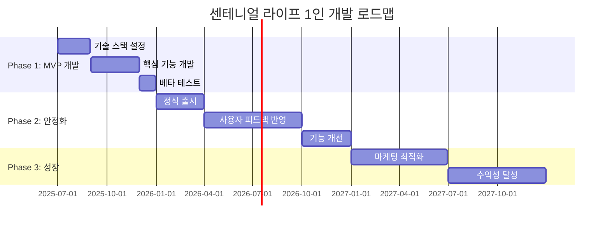

# 센테니얼 라이프 2025 구현 로드맵
## 1인 스타트업 웰니스 앱 개발 실행 계획서

---

### 📋 문서 정보
- **작성일**: 2025년 6월
- **버전**: 2025 v1.0
- **대상**: 1인 창업자, 솔로 개발자
- **범위**: MVP 개발 및 부트스트랩 성장 실행 계획

---

## 🎯 실행 전략 개요

### 구현 비전
**"최소 비용으로 최대 가치를 제공하는 실용적인 웰니스 앱 구축"**

1인 개발자 관점에서 실행 가능한 기술 스택과 간소화된 개발 프로세스를 통해, 사용자에게 실질적인 가치를 제공하는 웰니스 앱을 단계적으로 구축합니다.

### 핵심 실행 원칙

**1. 간단함 우선 (Simplicity First)**
```
👥 Lean Implementation
├── 3개 영역 집중: 건강추적, 정신건강, 커뮤니티만
├── 빠른 피드백: 주 단위 사용자 피드백 수집
├── 기능 최소화: 필수 기능만 구현 후 점진적 확장
└── 1인 운영: 모든 기능을 1인이 관리 가능하도록 설계
```

**2. 부트스트랩 운영 (Bootstrap Operations)**
```
⚠️ Resource Optimization
├── 기술 단순화: 검증된 기술만 사용
├── 자동화 우선: 반복 작업의 최대한 자동화
├── 외부 서비스: 직접 개발 대신 SaaS 활용
└── 단계적 투자: 수익 확보 후 점진적 기능 확장
```

**3. 수익 중심 확장 (Revenue-Driven Growth)**
```
📈 Sustainable Growth
├── 한국 시장 집중: 글로벌 확장 전 로컬 성공
├── 핵심 기능 완성: 3개 영역 완전 구현 후 확장
├── 유료 사용자 확보: 무료보다 유료 사용자 우선
└── 자립 후 확장: 수익성 달성 후 추가 투자 고려
```

---

## 📅 전체 타임라인 및 마일스톤

### 고수준 타임라인 (2025-2027)



### 주요 마일스톤

**2025년 목표**:
```
🎯 2025 Milestones
├── Q3 (7-8월): 기술 스택 설정
│   ├── Next.js + Supabase + OpenAI API 연동
│   ├── 기본 데이터베이스 설계
│   ├── 모바일 앱 기본 설정 (React Native)
│   └── 회원가입/로그인 기능 구현
├── Q4 (9-12월): MVP 개발 및 베타 출시
│   ├── 3개 핵심 영역 기능 개발
│   ├── 기본 AI 추천 기능 구현
│   ├── 베타 사용자 50명 모집
│   └── 초기 피드백 수집 및 개선
```

**2026년 목표**:
```
🎯 2026 Milestones
├── Q1 (1-3월): 정식 서비스 출시
│   ├── 한국 정식 앱 스토어 출시
│   ├── 500명 유료 구독자 달성
│   ├── MRR $5K 달성
│   └── 기본적인 고객 지원 시스템 구축
├── Q2-Q3 (4-9월): 기능 개선 및 사용자 확대
│   ├── 사용자 피드백 기반 기능 개선
│   ├── AI 추천 알고리즘 고도화
│   ├── 2,000명 사용자 달성
│   └── MRR $10K 달성
├── Q4 (10-12월): 마케팅 최적화
│   ├── 콘텐츠 마케팅 시스템 구축
│   ├── SEO 최적화 및 유기적 트래픽 증대
│   ├── 5,000명 사용자 달성
│   └── MRR $15K 달성
```

**2027년 목표**:
```
🎯 2027 Milestones
├── Q1-Q2 (1-6월): 성장 가속화
│   ├── 추천 프로그램 도입 및 최적화
│   ├── 입소문 마케팅 시스템 구축
│   ├── 10,000명 사용자 달성
│   └── MRR $20K 달성
├── Q3-Q4 (7-12월): 수익성 달성
│   ├── 운영 비용 최적화 및 수익성 확보
│   ├── 고급 기능 추가 개발
│   ├── 15,000명 사용자 달성
│   └── MRR $30K 달성 (수익성 달성)
```

---

## 🏗️ Phase 1: MVP 개발 (2025 Q3-Q4)

### 기술 스택 설정

**기술 스택 초기 설정 (2025.07-08)**:
```
☁️ Simple Tech Stack Setup
├── Week 1: 개발 환경 설정
│   ├── Next.js 프로젝트 초기화
│   ├── Supabase 데이터베이스 설정
│   ├── OpenAI API 연동 테스트
│   └── Vercel 배포 설정
├── Week 2: 모바일 앱 기본 설정
│   ├── React Native CLI 설정
│   ├── 기본 네비게이션 구성
│   ├── 안드로이드/iOS 기본 빌드 테스트
│   └── 디자인 시스템 기본 설정
├── Week 3: 데이터베이스 스키마 설계
│   ├── 사용자 계정 테이블 설계
│   ├── 건강 데이터 테이블 설계
│   ├── 커뮤니티 테이블 설계
│   └── 기본 인덱스 및 관계 설정
├── Week 4: 기본 기능 구현
│   ├── 사용자 인증 및 회원가입
│   ├── 대시보드 기본 기능
│   ├── 프로필 관리
│   └── 기본 데이터 CRUD 기능
```

**AI/ML 플랫폼 구축 (2025.08-10)**:
```
🤖 AI/ML Platform Development
├── Week 1-3: 데이터 파이프라인
│   ├── 데이터 수집 API 개발
│   ├── 데이터 전처리 파이프라인
│   ├── Feature Store 구축
│   └── 데이터 품질 모니터링
├── Week 4-8: 핵심 AI 모델 개발
│   ├── 건강 위험도 예측 모델
│   ├── 개인화 추천 알고리즘
│   ├── 자연어 처리 모델 (한국어)
│   └── 이상 탐지 모델
├── Week 9-10: 모델 서빙 인프라
│   ├── MLflow 모델 레지스트리 구축
│   ├── 모델 서빙 API 개발
│   ├── A/B 테스트 프레임워크
│   └── 모델 성능 모니터링
├── Week 11-12: 성능 최적화
│   ├── 모델 경량화 및 최적화
│   ├── 추론 속도 개선
│   ├── 확장성 테스트
│   └── 정확도 검증
```

### MVP 개발 (2025.08-11)

**핵심 기능 개발**:
```
📱 MVP Core Features
├── 사용자 관리 시스템 (Week 1-3):
│   ├── 회원가입/로그인 (SNS 연동 포함)
│   ├── 프로필 관리 및 개인화 설정
│   ├── 개인정보 동의 및 관리
│   └── 다중 인증 (MFA) 구현
├── 5개 핵심 웰니스 영역 (Week 4-10):
│   ├── 신체 건강: 바이탈 데이터 입력/추적
│   ├── 운동: 활동 추적 및 목표 설정
│   ├── 영양: 식사 기록 및 분석
│   ├── 수면: 수면 패턴 추적
│   └── 정신 건강: 기분 추적 및 스트레스 관리
├── AI 개인화 기능 (Week 8-11):
│   ├── 기본 건강 상태 분석
│   ├── 개인 맞춤 목표 설정
│   ├── 일일 권장사항 제공
│   └── 진전 상황 분석
├── 기본 커뮤니티 (Week 10-12):
│   ├── 사용자 프로필 및 피드
│   ├── 그룹 생성 및 참여
│   ├── 기본 메시징 기능
│   └── 좋아요/댓글 시스템
```

**모바일 앱 개발**:
```
📱 Mobile App Development
├── Android 앱 (Week 1-8):
│   ├── 네이티브 Android 개발 (Kotlin)
│   ├── Material Design 3 적용
│   ├── 웨어러블 연동 (Samsung Health, Fitbit)
│   └── 오프라인 지원 및 동기화
├── iOS 앱 (Week 4-10):
│   ├── 네이티브 iOS 개발 (Swift/SwiftUI)
│   ├── Human Interface Guidelines 준수
│   ├── HealthKit 연동
│   └── 접근성 기능 구현
├── 웹 앱 (Week 6-10):
│   ├── React.js 기반 웹 애플리케이션
│   ├── PWA (Progressive Web App) 구현
│   ├── 반응형 디자인
│   └── 시니어 친화적 UI/UX
├── 통합 테스트 (Week 11-12):
│   ├── 크로스 플랫폼 동기화 테스트
│   ├── 성능 및 사용성 테스트
│   ├── 보안 테스트
│   └── 접근성 테스트
```

### 베타 테스트 프로그램 (2025.10-12)

**베타 사용자 모집 및 관리**:
```
👥 Beta Testing Program
├── 사용자 모집 (Week 1-2):
│   ├── 타겟: 55-75세 시니어 1,000명
│   ├── 채널: 온라인 광고, 시니어 커뮤니티, 의료기관
│   ├── 선정 기준: 연령, 건강 상태, 기술 활용도
│   └── 동의서 및 NDA 체결
├── 온보딩 프로세스 (Week 2-3):
│   ├── 베타 테스터 교육 프로그램
│   ├── 앱 사용법 가이드 제공
│   ├── 피드백 수집 도구 안내
│   └── 1:1 지원 체계 구축
├── 테스트 실행 (Week 3-10):
│   ├── 기능별 테스트 시나리오 실행
│   ├── 주간 사용성 설문조사
│   ├── 포커스 그룹 인터뷰 (월 2회)
│   └── 실시간 사용 데이터 수집
├── 피드백 분석 및 개선 (Week 8-12):
│   ├── 정량적 데이터 분석 (사용률, 오류율)
│   ├── 정성적 피드백 분석 (만족도, 개선점)
│   ├── 우선순위 기반 개선사항 도출
│   └── 빠른 이터레이션을 통한 개선
```

---

## 🚀 Phase 2: 시장 진입 (2026 Q1-Q2)

### 한국 정식 출시 (2026.01-03)

**출시 준비**:
```
🇰🇷 Korea Launch Preparation
├── 규제 준수 완성 (Week 1-4):
│   ├── 개인정보보호법 완전 준수
│   ├── 의료기기법 해당 사항 검토
│   ├── 전자상거래법 준수
│   └── 소비자보호법 준수
├── 마케팅 캠페인 (Week 2-8):
│   ├── 브랜드 아이덴티티 완성
│   ├── 디지털 마케팅 캠페인 실행
│   ├── 인플루언서/KOL 파트너십
│   └── PR 및 미디어 관계 구축
├── 파트너십 구축 (Week 3-10):
│   ├── 주요 병원/클리닉 파트너십
│   ├── 보험사 협력 프로그램
│   ├── 웨어러블 제조사 연동 확대
│   └── 시니어 커뮤니티 센터 협력
├── 고객 지원 체계 (Week 4-8):
│   ├── 고객센터 구축 (전화, 채팅, 이메일)
│   ├── FAQ 및 도움말 시스템
│   ├── 시니어 전용 지원 프로그램
│   └── 다국어 지원 준비
```

**출시 실행 및 초기 운영**:
```
📈 Launch Execution
├── 소프트 런치 (Week 9-10):
│   ├── 베타 테스터 대상 정식 서비스 전환
│   ├── 제한적 신규 사용자 모집 (500명/주)
│   ├── 시스템 안정성 모니터링
│   └── 초기 사용자 피드백 수집
├── 공식 런치 (Week 11-12):
│   ├── 공식 출시 기자회견 및 이벤트
│   ├── 전면적 마케팅 캠페인 시작
│   ├── 앱 스토어 피처링 협상
│   └── 초기 KPI 달성 모니터링
├── 초기 성장 (Week 13-16):
│   ├── 사용자 획득 캠페인 최적화
│   ├── 제품 개선 및 기능 추가
│   ├── 고객 성공 프로그램 운영
│   └── 일본 진출 준비 시작
```

### 일본 시장 진출 (2026.04-06)

**현지화 및 준비**:
```
🇯🇵 Japan Market Entry
├── 현지화 작업 (Week 1-6):
│   ├── 일본어 완전 현지화
│   ├── 일본 의료 시스템 연동
│   ├── 현지 결제 시스템 연동
│   └── 일본 문화 고려 UX 개선
├── 규제 대응 (Week 2-8):
│   ├── 개인정보보호법 준수
│   ├── 약사법(의료기기) 검토
│   ├── 소비자계약법 준수
│   └── 현지 법무 법인 선임
├── 파트너십 구축 (Week 4-10):
│   ├── 현지 의료기관 파트너십
│   ├── 일본 IT 기업과 협력
│   ├── 현지 마케팅 에이전시
│   └── 시니어 관련 NPO/NGO 협력
├── 시장 진입 (Week 8-12):
│   ├── 일본 베타 테스트 (500명)
│   ├── 현지 피드백 기반 개선
│   ├── 정식 출시 및 마케팅
│   └── 초기 성과 측정
```

---

## 🌍 Phase 3: 글로벌 확장 (2026 Q3 - 2027 Q2)

### 북미 시장 진출 (2026.06-09)

**미국/캐나다 시장 준비**:
```
🇺🇸 North America Expansion
├── 규제 준비 (Week 1-12):
│   ├── FDA 의료기기 소프트웨어 인증 절차
│   ├── HIPAA 컴플라이언스 완성
│   ├── CCPA/CPRA 개인정보보호 준수
│   └── 각 주별 규제 요구사항 검토
├── 기술적 준비 (Week 4-16):
│   ├── 미국 클라우드 리전 구축
│   ├── 영어 AI 모델 개발 및 훈련
│   ├── 미국 의료 시스템 연동 준비
│   └── 현지 결제 및 보험 시스템 연동
├── 사업 개발 (Week 8-20):
│   ├── 현지 법인 설립
│   ├── 핵심 인력 채용 (현지 25명)
│   ├── 병원/보험사 파트너십 구축
│   └── 벤처 투자 유치 (Series B)
├── 시장 진입 (Week 16-24):
│   ├── 파일럿 프로그램 (10개 의료기관)
│   ├── 제한적 베타 서비스 (1,000명)
│   ├── 정식 출시 및 마케팅
│   └── B2B 고객 확보 집중
```

### 유럽 시장 진출 (2026.10 - 2027.03)

**영국/독일/프랑스 진출**:
```
🇪🇺 European Market Entry
├── GDPR 및 AI Act 완전 준수 (Week 1-8):
│   ├── EU AI Act 고위험 AI 시스템 인증
│   ├── GDPR 데이터 보호 영향평가
│   ├── CE-MDR 의료기기 인증 (필요시)
│   └── 각국별 추가 규제 요구사항
├── 다국가 현지화 (Week 4-12):
│   ├── 독일어, 프랑스어 현지화
│   ├── 각국 의료 시스템 연동
│   ├── 현지 결제 시스템 연동
│   └── 문화적 차이 고려 UX 개선
├── 전략적 파트너십 (Week 6-16):
│   ├── 유럽 주요 보험사 협력
│   ├── NHS (영국), 공보험 연동
│   ├── 유럽 의료기관 네트워크
│   └── 현지 기술 파트너십
├── 단계적 출시 (Week 12-24):
│   ├── 영국 우선 출시 (베타)
│   ├── 독일/프랑스 순차 출시
│   ├── EU 전체 확산 전략
│   └── 유럽 본부 설립 검토
```

---

## 👥 조직 및 인력 계획

### 팀 구성 및 확장 로드맵

**조직 확장 계획**:
```
👥 Team Scaling Plan
├── 2025 Q3-Q4 (50명 → 80명):
│   ├── 엔지니어링: +15명 (AI/ML, 백엔드, 모바일)
│   ├── 제품/디자인: +5명 (PM, UX/UI 디자이너)
│   ├── 마케팅: +5명 (디지털 마케팅, 콘텐츠)
│   ├── 영업: +3명 (B2B 영업, 파트너십)
│   └── 운영: +2명 (고객지원, 품질보증)
├── 2026 (80명 → 150명):
│   ├── 엔지니어링: +30명 (확장성, 보안, DevOps)
│   ├── 제품/디자인: +10명 (지역별 PM, 디자이너)
│   ├── 마케팅: +15명 (지역별 마케팅팀)
│   ├── 영업: +15명 (지역별 영업팀)
│   ├── 운영: +10명 (고객성공, 데이터분석)
│   └── 법무/컴플라이언스: +5명 (글로벌 규제 대응)
├── 2027 (150명 → 250명):
│   ├── 지역별 팀 확장: 각 지역 독립 운영팀
│   ├── 전문 기능 팀: AI 연구, 보안, 품질
│   ├── 사업 개발: M&A, 파트너십 전문팀
│   └── 기업 기능: HR, 재무, 법무 확대
```

**핵심 인재 채용 계획**:
```
🎯 Key Hiring Plan
├── 즉시 채용 (2025 Q3):
│   ├── CTO/VP of Engineering: 기술 리더십
│   ├── VP of Product: 제품 전략 및 관리
│   ├── VP of Marketing: 브랜드 및 마케팅 전략
│   ├── Chief Medical Officer: 의료 전문성
│   └── VP of Compliance: 글로벌 규제 전문가
├── 중기 채용 (2025 Q4-2026 Q2):
│   ├── 지역별 General Manager (일본, 북미)
│   ├── AI/ML 연구 책임자
│   ├── 사이버보안 책임자
│   ├── 고객 성공 책임자
│   └── 사업 개발 책임자
├── 장기 채용 (2026 Q3+):
│   ├── 각 지역별 핵심 리더십 팀
│   ├── 전문 분야별 시니어 전문가
│   ├── 차세대 리더 육성 프로그램
│   └── 글로벌 표준화 전문가
```

### 교육 및 개발 프로그램

**직원 역량 개발**:
```
📚 Employee Development
├── 온보딩 프로그램 (신입 직원):
│   ├── 회사 문화 및 가치 교육
│   ├── 제품 및 기술 교육
│   ├── 시니어 사용자 이해 교육
│   └── 컴플라이언스 및 보안 교육
├── 지속적 교육 (전 직원):
│   ├── 월간 기술 세미나
│   ├── 분기별 업계 트렌드 워크샵
│   ├── 연간 글로벌 컨퍼런스 참석
│   └── 개인별 학습 예산 지원
├── 리더십 개발:
│   ├── 관리자 교육 프로그램
│   ├── 멘토링 프로그램
│   ├── 크로스 펑셔널 프로젝트
│   └── 외부 리더십 코칭
└── 전문성 개발:
    ├── 기술 자격증 취득 지원
    ├── 업계 전문가 초청 강연
    ├── 외부 교육 과정 지원
    └── 컨퍼런스 발표 기회 제공
```

---

## 💰 투자 및 자금 조달 계획

### 투자 라운드 전략

**Series A (2025 Q3, $15M)**:
```
💰 Series A Funding ($15M)
├── 사용 목적:
│   ├── 제품 개발 완성: $6M (40%)
│   ├── 초기 마케팅: $3M (20%)
│   ├── 팀 확장: $4M (27%)
│   ├── 운영 자금: $1.5M (10%)
│   └── 비상 자금: $0.5M (3%)
├── 투자자 타겟:
│   ├── 헬스케어 전문 VC
│   ├── 시니어 테크 관심 투자자
│   ├── AI/ML 전문 펀드
│   └── 전략적 투자자 (보험사, 의료기관)
├── 투자 조건:
│   ├── 밸류에이션: $60M (pre-money)
│   ├── 투자자 지분: 20%
│   ├── 보드 구성: 5명 (창업자 2, 투자자 2, 독립 1)
│   └── 주요 조건: 우선주, 청산 우선권
```

**Series B (2026 Q2, $40M)**:
```
💰 Series B Funding ($40M)
├── 사용 목적:
│   ├── 글로벌 확장: $20M (50%)
│   ├── 기술 고도화: $8M (20%)
│   ├── 마케팅 확대: $6M (15%)
│   ├── 팀 확장: $4M (10%)
│   └── 운영 자금: $2M (5%)
├── 성과 기반 조달:
│   ├── $10M ARR 달성
│   ├── 50,000명 활성 사용자
│   ├── 규제 인증 완료
│   └── 주요 파트너십 성과
├── 투자자 다양화:
│   ├── 글로벌 VC 펀드
│   ├── 크로스오버 펀드
│   ├── 전략적 투자자 확대
│   └── 정부 펀드 (한국, 일본)
```

**Series C (2027 Q1, $80M)**:
```
💰 Series C Funding ($80M)
├── IPO 준비 라운드:
│   ├── 기업 가치: $500M+
│   ├── 성장 자금: 시장 지배력 확보
│   ├── 인수 자금: 전략적 M&A
│   └── IPO 준비: 기업 거버넌스 강화
├── 투자자 프로필:
│   ├── 성장 전문 VC
│   ├── Private Equity 펀드
│   ├── 소버린 웰스 펀드
│   └── 전략적 투자자 (빅테크)
```

### 재무 계획 및 예산

**연도별 예산 계획**:
```
📊 Annual Budget Planning
├── 2025 예산 ($8M):
│   ├── R&D: $3.5M (44%)
│   ├── 마케팅: $1.5M (19%)
│   ├── 인건비: $2.5M (31%)
│   ├── 운영비: $0.5M (6%)
├── 2026 예산 ($25M):
│   ├── R&D: $8M (32%)
│   ├── 마케팅: $7M (28%)
│   ├── 인건비: $8M (32%)
│   ├── 운영비: $2M (8%)
├── 2027 예산 ($60M):
│   ├── R&D: $15M (25%)
│   ├── 마케팅: $20M (33%)
│   ├── 인건비: $20M (33%)
│   ├── 운영비: $5M (8%)
```

---

## 📊 성과 측정 및 모니터링

### 핵심 성과 지표 (KPIs)

**제품 및 기술 KPIs**:
```
🔧 Product & Technology KPIs
├── 개발 속도:
│   ├── Sprint Velocity: 목표 대비 스토리 포인트 달성률
│   ├── 릴리즈 주기: 평균 2주 1회 배포
│   ├── 버그 수정 시간: 평균 24시간 이내
│   └── 기능 완성도: 계획 대비 기능 완성률 95%
├── 품질 지표:
│   ├── 시스템 가용성: 99.9% 업타임
│   ├── 응답 시간: API 평균 응답 200ms 이하
│   ├── 오류율: 전체 요청의 0.1% 이하
│   └── 사용자 만족도: 앱 스토어 평점 4.5/5.0
├── 보안 및 컴플라이언스:
│   ├── 보안 사고: 제로 데이터 유출
│   ├── 컴플라이언스 점수: 100% 규제 준수
│   ├── 인증 획득: 목표 인증 100% 취득
│   └── 감사 결과: 주요 발견사항 제로
```

**비즈니스 KPIs**:
```
📈 Business KPIs
├── 사용자 성장:
│   ├── 월간 활성 사용자 (MAU): 목표 달성률
│   ├── 신규 사용자 획득: 월별 성장률 15%
│   ├── 사용자 유지율: 12개월 유지율 85%
│   └── 바이럴 계수: K-factor 1.2 이상
├── 수익 지표:
│   ├── 연간 반복 수익 (ARR): 목표 달성률
│   ├── 월간 반복 수익 (MRR): 월별 성장률 20%
│   ├── 고객당 평균 수익 (ARPU): 지속적 증가
│   └── 고객 생애 가치 (LTV): CAC 대비 3배 이상
├── 운영 효율성:
│   ├── 고객 획득 비용 (CAC): 목표 대비 최적화
│   ├── 번인(Burn Rate): 계획 대비 80% 이하
│   ├── 현금 소진율: 18개월 이상 런웨이 유지
│   └── 운영 마진: 목표 마진율 달성
```

### 모니터링 및 보고 체계

**실시간 대시보드**:
```
📊 Real-time Monitoring
├── 경영진 대시보드:
│   ├── 핵심 비즈니스 지표 실시간 표시
│   ├── 주요 알림 및 이슈 상황
│   ├── 지역별 성과 비교
│   └── 예측 분석 및 트렌드
├── 운영 대시보드:
│   ├── 시스템 성능 및 가용성
│   ├── 사용자 활동 및 참여도
│   ├── 보안 이벤트 및 위협
│   └── 컴플라이언스 상태
├── 제품 대시보드:
│   ├── 기능별 사용률 및 성능
│   ├── A/B 테스트 결과
│   ├── 사용자 피드백 및 만족도
│   └── 제품 로드맵 진행률
```

**정기 보고 체계**:
```
📋 Regular Reporting
├── 일일 보고:
│   ├── 핵심 지표 요약 (CEO, CTO, CPO)
│   ├── 중요 이슈 및 대응 현황
│   ├── 당일 주요 성과 및 이슈
│   └── 다음날 우선순위 계획
├── 주간 보고:
│   ├── 전사 주간 성과 리뷰
│   ├── 각 팀별 진행 상황 공유
│   ├── 주요 이슈 및 해결 방안
│   └── 다음 주 목표 및 계획
├── 월간 보고:
│   ├── 월간 사업 성과 종합 분석
│   ├── 재무 현황 및 예산 집행률
│   ├── 인력 현황 및 채용 계획
│   └── 투자자 보고서
├── 분기별 보고:
│   ├── 분기 목표 달성도 평가
│   ├── 시장 동향 및 경쟁 분석
│   ├── 전략 수정 및 개선 방안
│   └── 다음 분기 목표 설정
```

---

## ⚠️ 위험 관리 및 대응 계획

### 주요 위험 요소 및 완화 전략

**기술적 위험**:
```
💻 Technical Risks
├── 개발 지연 위험:
│   ├── 완화 전략: Agile 방법론, 병렬 개발
│   ├── 모니터링: 일일 스탠드업, 스프린트 리뷰
│   ├── 대응 계획: 핵심 기능 우선순위 조정
│   └── 비상 계획: 외부 개발 리소스 확보
├── 확장성 문제:
│   ├── 완화 전략: 클라우드 네이티브 아키텍처
│   ├── 모니터링: 실시간 성능 모니터링
│   ├── 대응 계획: 자동 스케일링, 최적화
│   └── 비상 계획: 인프라 긴급 확장
├── 보안 위협:
│   ├── 완화 전략: 제로 트러스트 보안 모델
│   ├── 모니터링: 24/7 보안 운영 센터
│   ├── 대응 계획: 사고 대응 절차 수립
│   └── 비상 계획: 외부 보안 전문가 지원
```

**시장 위험**:
```
📊 Market Risks
├── 경쟁 심화:
│   ├── 완화 전략: 차별화된 가치 제안 강화
│   ├── 모니터링: 경쟁사 동향 지속 추적
│   ├── 대응 계획: 신속한 기능 개발 및 출시
│   └── 비상 계획: 전략적 파트너십 확대
├── 시장 진입 지연:
│   ├── 완화 전략: 규제 사전 준비
│   ├── 모니터링: 규제 환경 변화 추적
│   ├── 대응 계획: 대안 시장 우선 진출
│   └── 비상 계획: 현지 파트너십 활용
├── 사용자 채택 부진:
│   ├── 완화 전략: 철저한 사용자 연구
│   ├── 모니터링: 사용자 행동 데이터 분석
│   ├── 대응 계획: 빠른 제품 개선 이터레이션
│   └── 비상 계획: 마케팅 전략 재조정
```

**운영 위험**:
```
🏢 Operational Risks
├── 인재 확보 어려움:
│   ├── 완화 전략: 경쟁력 있는 보상 체계
│   ├── 모니터링: 채용 현황 및 이직률 추적
│   ├── 대응 계획: 채용 채널 다양화
│   └── 비상 계획: 외부 컨설팅 활용
├── 자금 조달 실패:
│   ├── 완화 전략: 복수 투자자 접촉
│   ├── 모니터링: 현금 흐름 일일 추적
│   ├── 대응 계획: 비용 절감 계획 실행
│   └── 비상 계획: 브릿지 펀딩 확보
├── 규제 변화:
│   ├── 완화 전략: 규제 당국과 소통 강화
│   ├── 모니터링: 규제 환경 변화 추적
│   ├── 대응 계획: 신속한 컴플라이언스 조정
│   └── 비상 계획: 법무 전문가 긴급 지원
```

---

## 🎯 성공 요인 및 결론

### 구현 성공의 핵심 요소

**1. 실행력 (Execution Excellence)**
- 명확한 로드맵과 마일스톤 기반의 체계적 실행
- 데이터 기반 의사결정과 빠른 이터레이션
- 위험 요소의 사전 식별 및 대응 계획 수립

**2. 사용자 중심 접근 (User-Centric Approach)**
- 시니어 사용자 니즈에 대한 깊은 이해
- 지속적인 사용자 피드백 수집 및 반영
- 접근성과 사용성을 고려한 제품 설계

**3. 기술적 우수성 (Technical Excellence)**
- 확장 가능하고 안전한 아키텍처 구축
- 최신 AI/ML 기술을 활용한 차별화
- 글로벌 서비스를 위한 인프라 준비

**4. 전략적 파트너십 (Strategic Partnerships)**
- 헬스케어 생태계 내 핵심 파트너와의 협력
- 각 지역별 현지 파트너십 구축
- 기술 및 비즈니스 시너지 창출

### 기대 성과

**단기 성과 (2025-2026)**:
- 한국/일본 시장에서 강력한 시장 위치 확보
- 10만 명 이상의 활성 사용자 기반 구축
- $10M ARR 달성 및 건실한 비즈니스 모델 검증
- 핵심 기술 및 규제 인증 완료

**중장기 성과 (2027+)**:
- 글로벌 시니어 웰니스 플랫폼 리더로 성장
- 100만 명 이상의 글로벌 사용자 서비스
- $50M+ ARR 달성 및 IPO 준비 완료
- 헬스케어 산업 혁신 사례로 인정

### 최종 메시지

센테니얼 라이프의 2025 구현 로드맵은 **체계적이고 현실적인 접근**을 통해 100세 시대의 웰니스 플랫폼이라는 비전을 달성하기 위한 구체적인 실행 계획입니다.

이 로드맵의 성공적인 실행을 통해:
- **사용자에게는** 더 건강하고 의미 있는 100세 인생을 지원하는 믿을 수 있는 동반자
- **투자자에게는** 지속 가능한 성장과 높은 수익을 제공하는 혁신 기업
- **사회에게는** 고령화 시대의 새로운 솔루션을 제시하는 사회적 가치 창조 기업

으로 성장하여, **'100세 시대의 웰니스 플랫폼 선도 기업'**이라는 목표를 달성하겠습니다.

---

*이 로드맵은 2025년 6월 기준으로 작성되었으며, 시장 상황과 기술 발전에 따라 유연하게 조정될 예정입니다.*