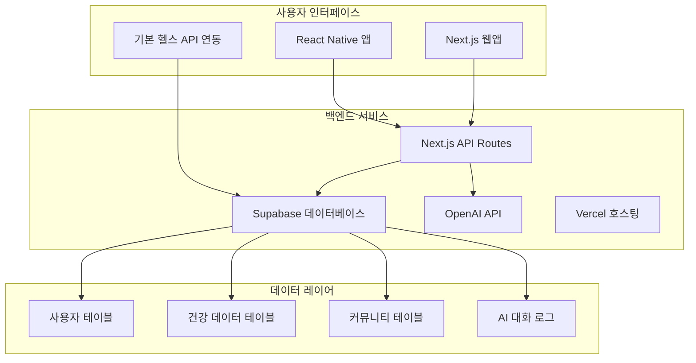
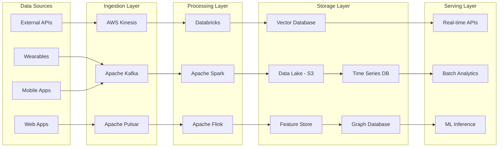

# 센테니얼 라이프 2025 기술 아키텍처
## 1인 스타트업 웰니스 앱 실용적 기술 설계서

---

### 📋 문서 정보
- **작성일**: 2025년 6월
- **버전**: 2025 v1.0
- **대상**: 1인 개발자, 솔로 창업자
- **범위**: MVP 개발을 위한 실용적 기술 스택

---

## 🎯 기술 비전 및 원칙

### 기술 비전
**"Simple, Scalable, Solo-Friendly 웰니스 앱"**

### 핵심 설계 원칙
1. **단순성**: 1인이 관리 가능한 단순한 아키텍처
2. **비용 효율성**: 최소 비용으로 최대 효과
3. **자동화**: 반복 작업의 최대한 자동화
4. **신뢰성**: 기본적인 안정성과 오류 처리
5. **확장성**: 필요시 쉽게 확장 가능한 구조
6. **보안성**: 기본적인 데이터 보호 및 인증
7. **유지보수성**: 코드 가독성과 디버깅 용이성

---

## 🏗️ 전체 시스템 아키텍처

### 고수준 아키텍처 개요



---

## 🔧 기술 스택 상세

### 프론트엔드 기술
**모바일 애플리케이션**:
- **React Native 0.73+**: 주력 크로스플랫폼 솔루션
- **React Navigation**: 네비게이션 및 라우팅
- **React Native Health**: 기본 헬스 API 연동
- **React Native Async Storage**: 로컬 데이터 저장

**웹 애플리케이션**:
- **Next.js 14**: 메인 프레임워크 (웹 + API)
- **TypeScript**: 타입 안전성
- **Tailwind CSS**: 빠른 스타일링
- **React Hook Form**: 폼 관리

**상태 관리**:
- **React Context**: 전역 상태 (사용자, 인증)
- **React Query**: 서버 데이터 캐싱
- **useState/useEffect**: 기본 상태 관리

### 백엔드 서비스

**메인 플랫폼**:
- **Next.js API Routes**: 주력 백엔드 API
- **Supabase**: 데이터베이스 + 인증 + 실시간 데이터
- **Vercel**: 호스팅 및 자동 배포
- **Go 1.21**: 고성능 데이터 처리 서비스
- **Rust**: 크리티컬 성능 서비스

**마이크로서비스 프레임워크**:
- **gRPC**: 서비스 간 고성능 통신
- **GraphQL**: 유연한 데이터 쿼리 인터페이스
- **REST API**: 표준 HTTP 인터페이스
- **Event Sourcing**: 이벤트 기반 상태 관리

### AI/ML 기술 스택

**대규모 언어 모델 (LLM)**:
- **OpenAI GPT-4o**: 개인 건강 어시스턴트
- **Anthropic Claude 3.5**: 의료 정보 분석
- **Meta Llama 3 70B**: 자체 호스팅 모델
- **Google Gemini Pro**: 멀티모달 분석

**ML 프레임워크**:
- **PyTorch 2.0**: 딥러닝 모델 개발
- **TensorFlow 2.13**: 프로덕션 모델 배포
- **scikit-learn**: 전통적 ML 알고리즘
- **XGBoost/LightGBM**: 구조화된 데이터 예측

**AI 서비스**:
- **OpenAI API**: 메인 AI 기능 (추천, 분석, 대화)
- **OpenAI GPT-4**: 텍스트 분석 및 건강 컨설팅
- **기본 데이터 분석**: JavaScript/TypeScript로 간단한 통계
- **사용자 선호 학습**: 로컬 데이터 기반 간단한 패턴 분석

**외부 API 연동**:
- **HealthKit (iOS)**: 아이폰 건강 데이터
- **Google Fit (Android)**: 안드로이드 건강 데이터
- **이메일 전송**: Resend 또는 SendGrid
- **알림**: Firebase FCM

---

## 📊 데이터 아키텍처

### 데이터 플로우 설계



### 데이터 저장 전략

**실시간 데이터**:
- **Apache Kafka**: 고처리량 실시간 스트리밍
- **Apache Pulsar**: 멀티테넌트 메시징
- **Redis Streams**: 실시간 이벤트 스트리밍

**분석 데이터**:
- **Amazon S3 + Delta Lake**: 확장 가능한 데이터 레이크
- **Apache Iceberg**: 오픈 테이블 포맷
- **Snowflake**: 클라우드 데이터 웨어하우스

**운영 데이터**:
- **PostgreSQL 15**: 메인 관계형 데이터베이스
- **MongoDB 7.0**: 문서 기반 사용자 데이터
- **Cassandra**: 대용량 시계열 데이터

**특화 데이터베이스**:
- **InfluxDB**: 시계열 센서 데이터
- **Neo4j**: 사용자 관계 그래프
- **Pinecone**: 벡터 유사도 검색
- **OpenSearch**: 로그 및 검색 엔진

---

## 🤖 AI/ML 아키텍처

### AI 서비스 구조

**개인화 AI 엔진**:
```python
# 개인화 추천 시스템 아키�ecture
class PersonalizationEngine:
    def __init__(self):
        self.user_embedding = UserEmbeddingModel()
        self.content_embedding = ContentEmbeddingModel()
        self.collaborative_filter = CollaborativeFilterModel()
        self.health_predictor = HealthPredictionModel()
    
    async def get_recommendations(self, user_id: str, context: dict):
        user_vector = await self.user_embedding.encode(user_id)
        health_state = await self.health_predictor.predict(user_id)
        
        recommendations = await self.generate_recommendations(
            user_vector, health_state, context
        )
        return recommendations
```

**멀티모달 AI 처리**:
- **텍스트**: 자연어 처리 및 의도 이해
- **음성**: 감정 및 건강 상태 분석
- **이미지**: 식단, 운동 자세 분석
- **센서**: 생체신호 패턴 인식

**실시간 AI 추론**:
- **Model Serving**: TensorFlow Serving, TorchServe
- **Edge AI**: TensorFlow Lite, ONNX Runtime
- **GPU 클러스터**: NVIDIA A100, H100
- **Auto Scaling**: HPA 기반 동적 확장

### 연합 학습 (Federated Learning)

```python
# 프라이버시 보호 연합 학습
class FederatedLearningFramework:
    def __init__(self):
        self.global_model = GlobalHealthModel()
        self.aggregator = FedAvgAggregator()
        self.privacy_engine = DifferentialPrivacyEngine()
    
    async def train_round(self, selected_clients: List[str]):
        client_updates = []
        
        for client_id in selected_clients:
            # 클라이언트별 로컬 모델 훈련
            local_update = await self.train_local_model(client_id)
            
            # 차분 프라이버시 적용
            private_update = self.privacy_engine.add_noise(local_update)
            client_updates.append(private_update)
        
        # 글로벌 모델 업데이트
        global_update = self.aggregator.aggregate(client_updates)
        await self.global_model.update(global_update)
```

---

## ☁️ 클라우드 인프라

### 멀티 클라우드 전략

**Primary Cloud (AWS)**:
- **컴퓨팅**: EKS, EC2, Lambda
- **스토리지**: S3, EFS, EBS
- **데이터베이스**: RDS, DynamoDB, ElastiCache
- **AI/ML**: SageMaker, Bedrock, Rekognition

**Secondary Cloud (Azure)**:
- **컴퓨팅**: AKS, VM, Functions
- **AI/ML**: Azure OpenAI, Cognitive Services
- **데이터**: Cosmos DB, Azure SQL
- **백업**: 재해 복구 및 데이터 백업

**Edge Computing**:
- **CloudFlare Workers**: 글로벌 엣지 컴퓨팅
- **AWS Wavelength**: 5G 엣지 서비스
- **Azure Edge Zones**: 지연 시간 최소화

### 컨테이너 오케스트레이션

**Kubernetes 클러스터 구성**:
```yaml
# 고가용성 Kubernetes 클러스터
apiVersion: v1
kind: Namespace
metadata:
  name: centennial-life
---
apiVersion: apps/v1
kind: Deployment
metadata:
  name: health-api
  namespace: centennial-life
spec:
  replicas: 10
  selector:
    matchLabels:
      app: health-api
  template:
    metadata:
      labels:
        app: health-api
    spec:
      containers:
      - name: health-api
        image: centennial/health-api:v2025.1
        resources:
          requests:
            memory: "512Mi"
            cpu: "500m"
          limits:
            memory: "1Gi"
            cpu: "1000m"
        env:
        - name: DATABASE_URL
          valueFrom:
            secretKeyRef:
              name: db-secret
              key: url
```

**서비스 메시 (Istio)**:
- **트래픽 관리**: 로드 밸런싱, 카나리 배포
- **보안**: mTLS, 서비스 간 인증
- **관찰성**: 분산 추적, 메트릭 수집

---

## 🔒 보안 아키텍처

### 제로 트러스트 보안 모델

**인증 및 권한 부여**:
- **OAuth 2.0 + PKCE**: 모바일 앱 보안 인증
- **JWT + JWE**: 토큰 기반 인증 및 암호화
- **Multi-Factor Authentication**: 생체인식, SMS, TOTP
- **Device Trust**: 디바이스 지문 인식 및 검증

**데이터 보호**:
- **종단간 암호화**: AES-256-GCM 암호화
- **동형 암호화**: 암호화된 데이터 연산
- **키 관리**: AWS KMS, HashiCorp Vault
- **데이터 마스킹**: 민감 정보 자동 마스킹

**네트워크 보안**:
```yaml
# 네트워크 정책 예시
apiVersion: networking.k8s.io/v1
kind: NetworkPolicy
metadata:
  name: health-data-policy
spec:
  podSelector:
    matchLabels:
      app: health-service
  policyTypes:
  - Ingress
  - Egress
  ingress:
  - from:
    - podSelector:
        matchLabels:
          app: api-gateway
    ports:
    - protocol: TCP
      port: 8080
  egress:
  - to:
    - podSelector:
        matchLabels:
          app: database
    ports:
    - protocol: TCP
      port: 5432
```

### 프라이버시 보호 기술

**차분 프라이버시**:
```python
class DifferentialPrivacy:
    def __init__(self, epsilon: float = 1.0):
        self.epsilon = epsilon
    
    def add_laplace_noise(self, data: np.ndarray, sensitivity: float):
        noise = np.random.laplace(
            loc=0, 
            scale=sensitivity / self.epsilon, 
            size=data.shape
        )
        return data + noise
    
    def private_aggregation(self, values: List[float]):
        true_sum = sum(values)
        noisy_sum = self.add_laplace_noise(
            np.array([true_sum]), 
            sensitivity=1.0
        )[0]
        return noisy_sum
```

**데이터 최소화**:
- **목적 제한**: 수집 목적에 필요한 최소 데이터만 처리
- **보존 기간**: 자동 데이터 삭제 정책
- **익명화**: k-익명성, l-다양성 보장

---

## 🚀 성능 최적화

### 확장성 전략

**수평적 확장**:
- **Auto Scaling**: CPU, 메모리, 큐 길이 기반
- **Load Balancing**: 지리적 분산 및 지능형 라우팅
- **Database Sharding**: 사용자 기반 데이터 분할
- **CDN**: 정적 콘텐츠 글로벌 캐싱

**캐싱 전략**:
```python
# 다층 캐싱 시스템
class MultiTierCache:
    def __init__(self):
        self.l1_cache = {}  # 로컬 메모리 캐시
        self.l2_cache = redis.Redis()  # Redis 캐시
        self.l3_cache = memcached.Client()  # Memcached
    
    async def get(self, key: str):
        # L1 캐시 확인
        if key in self.l1_cache:
            return self.l1_cache[key]
        
        # L2 캐시 확인
        value = await self.l2_cache.get(key)
        if value:
            self.l1_cache[key] = value
            return value
        
        # L3 캐시 확인
        value = await self.l3_cache.get(key)
        if value:
            await self.l2_cache.set(key, value, ex=3600)
            self.l1_cache[key] = value
            return value
        
        return None
```

### 실시간 처리 최적화

**스트림 처리**:
- **Apache Flink**: 복잡한 이벤트 처리
- **Apache Kafka Streams**: 실시간 데이터 변환
- **Apache Storm**: 고속 스트림 처리

**데이터베이스 최적화**:
- **읽기 복제본**: 읽기 작업 분산
- **파티셔닝**: 시간 기반 데이터 분할
- **인덱스 최적화**: 복합 인덱스 및 부분 인덱스
- **Connection Pooling**: 연결 재사용 최적화

---

## 📊 모니터링 및 관찰성

### 통합 모니터링 시스템

**메트릭 수집**:
- **Prometheus**: 시계열 메트릭 수집
- **Grafana**: 실시간 대시보드
- **Datadog**: 종합 모니터링 플랫폼
- **New Relic**: 애플리케이션 성능 모니터링

**로깅 시스템**:
```yaml
# ELK Stack 구성
apiVersion: v1
kind: ConfigMap
metadata:
  name: logstash-config
data:
  logstash.conf: |
    input {
      beats {
        port => 5044
      }
    }
    
    filter {
      if [fields][service] == "health-api" {
        grok {
          match => { "message" => "%{TIMESTAMP_ISO8601:timestamp} %{LOGLEVEL:level} %{DATA:logger} - %{GREEDYDATA:message}" }
        }
      }
    }
    
    output {
      elasticsearch {
        hosts => ["elasticsearch:9200"]
        index => "centennial-life-%{+YYYY.MM.dd}"
      }
    }
```

**분산 추적**:
- **Jaeger**: 분산 시스템 추적
- **Zipkin**: 마이크로서비스 성능 추적
- **OpenTelemetry**: 표준화된 관찰성 데이터

### 알림 및 인시던트 관리

**알림 시스템**:
- **PagerDuty**: 인시던트 관리 및 에스컬레이션
- **Slack/Teams**: 실시간 알림 통합
- **Email/SMS**: 크리티컬 이슈 즉시 알림

**SLA/SLO 정의**:
- **가용성**: 99.9% 업타임
- **응답 시간**: 95%ile < 200ms
- **처리량**: 초당 10,000 요청 처리
- **데이터 일관성**: 강한 일관성 보장

---

## 🔄 DevOps 및 배포 전략

### CI/CD 파이프라인

```yaml
# GitHub Actions CI/CD
name: Deploy to Production
on:
  push:
    branches: [main]

jobs:
  test:
    runs-on: ubuntu-latest
    steps:
    - uses: actions/checkout@v4
    - name: Run Tests
      run: |
        npm test
        python -m pytest
        go test ./...
        
  security-scan:
    runs-on: ubuntu-latest
    steps:
    - uses: actions/checkout@v4
    - name: Security Scan
      run: |
        trivy fs .
        sonar-scanner
        
  deploy:
    needs: [test, security-scan]
    runs-on: ubuntu-latest
    steps:
    - name: Deploy to Kubernetes
      run: |
        kubectl apply -f k8s/
        kubectl rollout status deployment/health-api
```

**배포 전략**:
- **Blue-Green Deployment**: 무중단 배포
- **Canary Deployment**: 점진적 배포
- **Feature Flags**: 기능별 배포 제어
- **Rollback**: 자동 롤백 메커니즘

### 인프라 as 코드

**Terraform 구성**:
```hcl
# AWS EKS 클러스터 프로비저닝
resource "aws_eks_cluster" "centennial_life" {
  name     = "centennial-life-cluster"
  role_arn = aws_iam_role.cluster_role.arn
  version  = "1.27"

  vpc_config {
    subnet_ids = var.subnet_ids
    endpoint_private_access = true
    endpoint_public_access  = true
  }

  depends_on = [
    aws_iam_role_policy_attachment.cluster_policy,
  ]
}

resource "aws_eks_node_group" "workers" {
  cluster_name    = aws_eks_cluster.centennial_life.name
  node_group_name = "workers"
  node_role_arn   = aws_iam_role.worker_role.arn
  subnet_ids      = var.worker_subnet_ids

  instance_types = ["m5.xlarge", "m5.2xlarge"]
  
  scaling_config {
    desired_size = 10
    max_size     = 50
    min_size     = 5
  }
}
```

---

## 🌐 API 설계

### GraphQL 스키마

```graphql
# 사용자 건강 데이터 스키마
type User {
  id: ID!
  email: String!
  profile: UserProfile!
  healthData: HealthData!
  recommendations: [Recommendation!]!
}

type HealthData {
  vitals: VitalSigns!
  activities: [Activity!]!
  nutrition: NutritionData!
  sleep: SleepData!
  mood: MoodData!
}

type Recommendation {
  id: ID!
  type: RecommendationType!
  title: String!
  description: String!
  confidence: Float!
  createdAt: DateTime!
}

type Query {
  user(id: ID!): User
  healthInsights(userId: ID!, timeRange: TimeRange!): [Insight!]!
  recommendations(userId: ID!, limit: Int): [Recommendation!]!
}

type Mutation {
  updateHealthData(input: HealthDataInput!): HealthData!
  createGoal(input: GoalInput!): Goal!
  recordActivity(input: ActivityInput!): Activity!
}

type Subscription {
  healthAlerts(userId: ID!): HealthAlert!
  realTimeVitals(userId: ID!): VitalSigns!
}
```

### REST API 엔드포인트

```typescript
// API 라우트 정의
interface HealthAPI {
  // 사용자 관리
  'GET /api/v1/users/:id': GetUserResponse;
  'PUT /api/v1/users/:id': UpdateUserRequest;
  
  // 건강 데이터
  'GET /api/v1/health/:userId/vitals': GetVitalsResponse;
  'POST /api/v1/health/:userId/vitals': CreateVitalRequest;
  
  // AI 추천
  'GET /api/v1/recommendations/:userId': GetRecommendationsResponse;
  'POST /api/v1/recommendations/:userId/feedback': FeedbackRequest;
  
  // 실시간 알림
  'GET /api/v1/alerts/:userId': GetAlertsResponse;
  'POST /api/v1/alerts/:userId/acknowledge': AcknowledgeAlertRequest;
}
```

---

## 📱 모바일 최적화

### 오프라인 우선 설계

```typescript
// 오프라인 데이터 동기화
class OfflineSync {
  private db: SQLiteDatabase;
  private syncQueue: SyncQueue;
  
  async recordHealthData(data: HealthData): Promise<void> {
    // 로컬 저장
    await this.db.insert('health_data', data);
    
    // 동기화 큐에 추가
    await this.syncQueue.add({
      type: 'health_data',
      action: 'create',
      data: data,
      timestamp: Date.now()
    });
    
    // 네트워크 연결 시 자동 동기화
    if (await this.isOnline()) {
      await this.syncPendingData();
    }
  }
  
  async syncPendingData(): Promise<void> {
    const pendingItems = await this.syncQueue.getAll();
    
    for (const item of pendingItems) {
      try {
        await this.uploadToServer(item);
        await this.syncQueue.remove(item.id);
      } catch (error) {
        console.error('Sync failed:', error);
        // 재시도 로직
      }
    }
  }
}
```

### 배터리 최적화

```swift
// iOS 배터리 최적화
class BatteryOptimizedHealthMonitoring {
    private let healthStore = HKHealthStore()
    private var backgroundTask: UIBackgroundTaskIdentifier = .invalid
    
    func startOptimizedMonitoring() {
        // 배터리 상태에 따른 모니터링 주기 조절
        let batteryLevel = UIDevice.current.batteryLevel
        let monitoringInterval: TimeInterval
        
        switch batteryLevel {
        case 0.8...1.0:
            monitoringInterval = 60 // 1분
        case 0.5...0.8:
            monitoringInterval = 300 // 5분
        case 0.2...0.5:
            monitoringInterval = 600 // 10분
        default:
            monitoringInterval = 1800 // 30분
        }
        
        scheduleHealthDataCollection(interval: monitoringInterval)
    }
    
    func scheduleHealthDataCollection(interval: TimeInterval) {
        let timer = Timer.scheduledTimer(withTimeInterval: interval, repeats: true) { _ in
            self.collectHealthData()
        }
        
        // 백그라운드 실행 최적화
        backgroundTask = UIApplication.shared.beginBackgroundTask {
            timer.invalidate()
            UIApplication.shared.endBackgroundTask(self.backgroundTask)
        }
    }
}
```

---

## 🧪 테스트 전략

### 자동화된 테스트 피라미드

**단위 테스트 (70%)**:
```python
# AI 모델 테스트 예시
import pytest
from unittest.mock import Mock
from src.ai.health_predictor import HealthPredictor

class TestHealthPredictor:
    def setup_method(self):
        self.predictor = HealthPredictor()
        self.mock_data = {
            'heart_rate': [70, 72, 75, 68],
            'blood_pressure': [(120, 80), (118, 79)],
            'activity_level': 'moderate'
        }
    
    @pytest.mark.asyncio
    async def test_risk_assessment(self):
        result = await self.predictor.assess_risk(self.mock_data)
        
        assert result['risk_level'] in ['low', 'medium', 'high']
        assert 0 <= result['confidence'] <= 1
        assert 'recommendations' in result
    
    def test_data_validation(self):
        invalid_data = {'heart_rate': [-10, 300]}
        
        with pytest.raises(ValueError):
            self.predictor.validate_input(invalid_data)
```

**통합 테스트 (20%)**:
```typescript
// API 통합 테스트
describe('Health API Integration', () => {
  let app: Application;
  let testUser: User;
  
  beforeAll(async () => {
    app = await createTestApp();
    testUser = await createTestUser();
  });
  
  test('should create and retrieve health data', async () => {
    const healthData = {
      heart_rate: 72,
      blood_pressure: [120, 80],
      timestamp: new Date().toISOString()
    };
    
    // 데이터 생성
    const createResponse = await request(app)
      .post(`/api/v1/health/${testUser.id}/vitals`)
      .send(healthData)
      .expect(201);
    
    // 데이터 조회
    const getResponse = await request(app)
      .get(`/api/v1/health/${testUser.id}/vitals`)
      .expect(200);
    
    expect(getResponse.body).toContainEqual(
      expect.objectContaining(healthData)
    );
  });
});
```

**E2E 테스트 (10%)**:
```typescript
// Playwright E2E 테스트
import { test, expect } from '@playwright/test';

test('complete health tracking workflow', async ({ page }) => {
  // 로그인
  await page.goto('/login');
  await page.fill('[data-testid=email]', 'test@example.com');
  await page.fill('[data-testid=password]', 'password123');
  await page.click('[data-testid=login-button]');
  
  // 건강 데이터 입력
  await page.goto('/health/vitals');
  await page.fill('[data-testid=heart-rate]', '72');
  await page.fill('[data-testid=blood-pressure-systolic]', '120');
  await page.fill('[data-testid=blood-pressure-diastolic]', '80');
  await page.click('[data-testid=save-button]');
  
  // 데이터 확인
  await expect(page.locator('[data-testid=success-message]')).toBeVisible();
  
  // 대시보드에서 데이터 확인
  await page.goto('/dashboard');
  await expect(page.locator('[data-testid=heart-rate-display]')).toHaveText('72 bpm');
});
```

---

## 🚀 마이그레이션 및 업그레이드 전략

### 기존 시스템에서의 마이그레이션

**데이터 마이그레이션**:
```python
# 안전한 데이터 마이그레이션
class DataMigration:
    def __init__(self, source_db, target_db):
        self.source = source_db
        self.target = target_db
        
    async def migrate_user_data(self, batch_size: int = 1000):
        offset = 0
        
        while True:
            # 배치 단위로 데이터 조회
            batch = await self.source.fetch_users(
                limit=batch_size, 
                offset=offset
            )
            
            if not batch:
                break
                
            # 데이터 변환
            transformed_batch = [
                self.transform_user_data(user) 
                for user in batch
            ]
            
            # 타겟 DB에 저장
            await self.target.bulk_insert_users(transformed_batch)
            
            # 검증
            await self.validate_migration(batch, transformed_batch)
            
            offset += batch_size
            
            # 진행률 로깅
            logger.info(f"Migrated {offset} users")
```

### 무중단 업그레이드

**Blue-Green 배포**:
```bash
#!/bin/bash
# 무중단 배포 스크립트

# 현재 활성 환경 확인
ACTIVE_ENV=$(kubectl get service health-api -o jsonpath='{.spec.selector.version}')
INACTIVE_ENV=$([ "$ACTIVE_ENV" = "blue" ] && echo "green" || echo "blue")

echo "Active environment: $ACTIVE_ENV"
echo "Deploying to inactive environment: $INACTIVE_ENV"

# 비활성 환경에 새 버전 배포
kubectl apply -f k8s/deployment-$INACTIVE_ENV.yaml
kubectl rollout status deployment/health-api-$INACTIVE_ENV

# 헬스 체크
kubectl exec deployment/health-api-$INACTIVE_ENV -- /app/health-check.sh

# 트래픽 전환
kubectl patch service health-api -p '{"spec":{"selector":{"version":"'$INACTIVE_ENV'"}}}'

echo "Traffic switched to $INACTIVE_ENV"

# 이전 환경 정리 (옵션)
read -p "Delete old environment? (y/N): " -n 1 -r
if [[ $REPLY =~ ^[Yy]$ ]]; then
    kubectl delete deployment health-api-$ACTIVE_ENV
fi
```

---

## 📈 성능 벤치마크 및 목표

### 핵심 성능 지표

**응답 시간 목표**:
- API 응답: P95 < 200ms
- AI 추론: P95 < 500ms
- 데이터베이스 쿼리: P95 < 50ms
- 웹 페이지 로딩: P95 < 2초

**처리량 목표**:
- API 요청: 10,000 RPS
- 실시간 데이터 처리: 100,000 events/sec
- 동시 사용자: 100,000 concurrent users
- 데이터 수집: 1M data points/min

**자원 사용률**:
- CPU 사용률: < 70%
- 메모리 사용률: < 80%
- 네트워크 대역폭: < 80%
- 스토리지 IOPS: < 70%

---

## 🎯 결론

센테니얼 라이프 2025 기술 아키텍처는 최신 클라우드 네이티브 기술과 AI/ML 혁신을 결합하여, 확장 가능하고 안전하며 고성능의 웰니스 플랫폼을 구축하는 설계도를 제시합니다.

### 핵심 기술적 우위
1. **AI-First 아키텍처**: 모든 서비스에 AI/ML이 네이티브하게 통합
2. **실시간 처리**: 스트리밍 기반 즉시 반응 시스템
3. **프라이버시 보호**: 연합 학습과 차분 프라이버시 적용
4. **글로벌 확장성**: 멀티 클라우드 및 엣지 컴퓨팅 활용
5. **개발자 친화적**: 현대적 DevOps 및 관찰성 도구 통합

이 아키텍처는 100세 시대의 웰니스 플랫폼으로서 필요한 모든 기술적 요구사항을 충족하며, 지속적인 혁신과 확장을 지원하는 견고한 기반을 제공합니다.

---

*이 문서는 2024년 기술 계획을 바탕으로 2025년 최신 기술 트렌드와 모범 사례를 반영하여 작성되었습니다.*